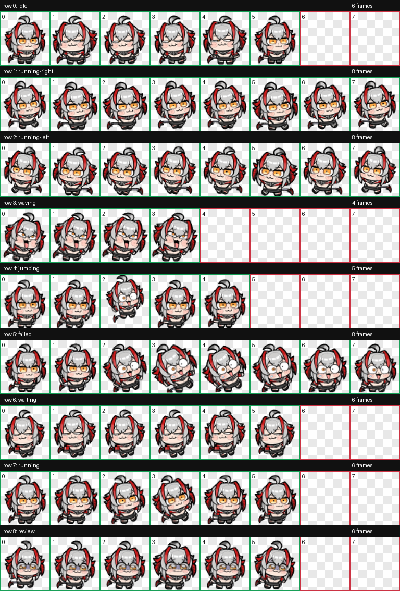

# Wisdel Codex Pet

A custom animated Codex pet built from the Wisdel desktop companion materials in
`digit_maid`. The pet is assembled by directly pixelizing the original GIF
frames, so the character identity, orange eyes, expressions, and tiny chibi
silhouette stay close to the source art instead of being redrawn.



## What Is Included

This repository is a full bundle, not only the final two pet files.

| Path | Purpose |
| --- | --- |
| `installable-pet/` | Minimal package that Codex can load directly. |
| `installable-pet/pet.json` | Codex pet manifest. |
| `installable-pet/spritesheet.webp` | Final 8x9 animated spritesheet. |
| `build-output/` | Full build output: extracted frames, final atlas, QA files, and previews. |
| `build-output/qa/contact-sheet.png` | Visual QA sheet for all animation rows. |
| `build-output/qa/videos/` | Per-state preview videos. |
| `source-materials/皮肤素材/` | Original Wisdel material folder used as input. |
| `references/maidbit-materials/` | Reference sheets generated while preparing the pet. |
| `tools/build_wisdel_pixel_pet.py` | Rebuild script used for this direct-pixelization version. |

## Install

Copy the installable package into Codex's local pet directory:

```bash
ditto installable-pet ~/.codex/pets/wisdel
```

Then restart Codex if the pet list does not refresh immediately.

After installation, the expected files are:

```text
~/.codex/pets/wisdel/
  pet.json
  spritesheet.webp
```

## Animation Rows

Codex pets use a fixed 8-column by 9-row atlas. This pet fills the rows as:

| Row | State | Source behavior |
| --- | --- | --- |
| 0 | `idle` | Calm blink and breathing loop. |
| 1 | `running-right` | Front-facing active motion, used for right movement. |
| 2 | `running-left` | Mirrored movement row. |
| 3 | `waving` | Excited greeting-style motion. |
| 4 | `jumping` | Jump / surprise motion. |
| 5 | `failed` | Shocked failed-state reaction. |
| 6 | `waiting` | Patient sitting loop. |
| 7 | `running` | Busy task-running loop. |
| 8 | `review` | Focused review loop with glasses expression. |

Codex does not randomly play every row at all times. In normal idle state you
will mostly see the `idle` row; other rows appear when Codex enters matching
states such as running, waiting, failure, review, hover, or movement.

## Rebuild

The pet was generated with:

```bash
python3 tools/build_wisdel_pixel_pet.py
```

The script reads the Wisdel GIF materials, preserves their alpha channel,
pixelizes each selected frame, normalizes body size across rows, builds the
Codex spritesheet, renders QA previews, and writes a minimal installable pet
package.

If you move this repository to a different machine, update the source path in
`tools/build_wisdel_pixel_pet.py` or point it at the bundled
`source-materials/皮肤素材/可用素材` directory before rebuilding.

## QA

Generated QA artifacts:

- Contact sheet: `build-output/qa/contact-sheet.png`
- Source sheet preview: `build-output/qa/source-sheet-pixelized.png`
- Frame review JSON: `build-output/qa/review.json`
- Atlas validation JSON: `build-output/final/validation.json`
- Preview videos: `build-output/qa/videos/`

The final spritesheet passed atlas validation with no errors or warnings.

## Notes

- The black outline is preserved from the original transparent GIF frames.
- The source GIF alpha channel is used directly; the build does not chroma-key
  black, because that would damage Wisdel's outline and dark costume details.
- The current movement rows are front-facing motion adapted to Codex's row
  layout, because the source set does not include a true side-running cycle.
- `special0.gif` is kept in the source materials but not used in the final pet,
  because it contains a second character and a much larger composition.

## License And Credits

This is a fan-made Codex pet package assembled from local Wisdel materials.
Original character art and source assets belong to their respective rights
holders. This repository is intended for personal, non-commercial customization
and is not an official Codex, OpenAI, or game asset release.
